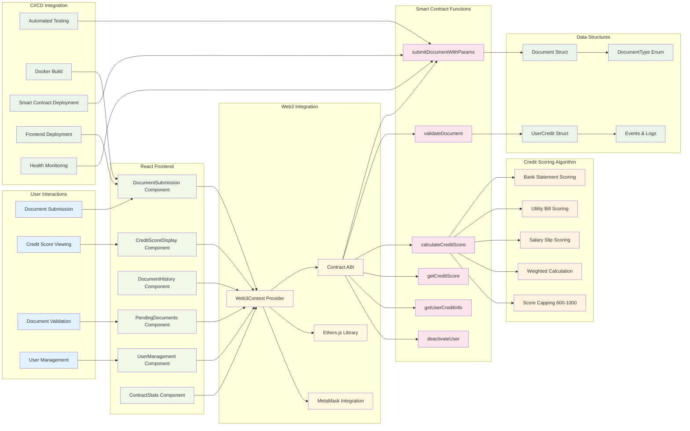
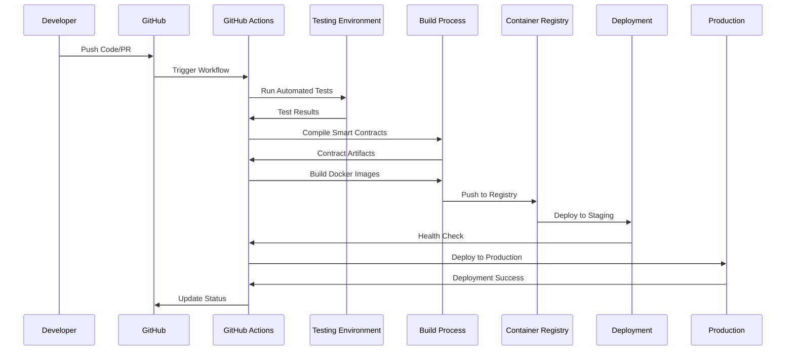
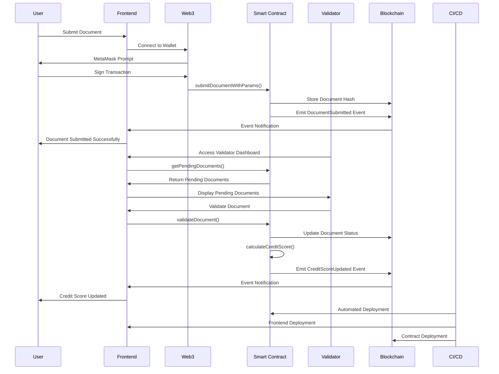

# Credit Scoring Dashboard - System Architecture

## Overview
A blockchain-based credit scoring platform with automated CI/CD pipeline, Docker containerization, and GitHub Actions integration for seamless deployment and testing.

## System Architecture Diagram

```mermaid
graph TB
    %% GitHub Repository & CI/CD
    subgraph "GitHub Repository & CI/CD"
        GH[GitHub Repository]
        GA[GitHub Actions]
        CR[Container Registry]
        WF[Workflow Triggers]
    end

    %% Development Environment
    subgraph "Development Environment"
        DEV[Local Development]
        GANACHE[Ganache Local Blockchain]
        TRUFFLE[Truffle Framework]
        REACT_DEV[React Dev Server]
        DOCKER_COMPOSE[Docker Compose]
    end

    %% CI/CD Pipeline
    subgraph "CI/CD Pipeline"
        TRIGGER[Code Push/PR]
        TEST[Automated Testing]
        BUILD[Smart Contract Compilation]
        DOCKER_BUILD[Docker Image Build]
        DEPLOY[Automated Deployment]
        HEALTH[Health Checks]
    end

    %% Frontend Application
    subgraph "Frontend Application (React)"
        UI[User Interface]
        UD[UserDashboard.jsx]
        VD[ValidatorDashboard.jsx]
        WC[WalletConnect.jsx]
        W3C[Web3Context.jsx]
        COMP[UI Components]
        CONTRACT_INT[Contract Integration]
    end

    %% Blockchain Layer
    subgraph "Blockchain Layer"
        ETH[Ethereum Network]
        SC[Smart Contract - dashboard.sol]
        DOC_STORE[Document Storage]
        CREDIT_CALC[Credit Score Calculation]
        EVENTS[Blockchain Events]
    end

    %% Smart Contract Components
    subgraph "Smart Contract Components"
        DOC_MGMT[Document Management]
        USER_CREDIT[User Credit System]
        VALIDATION[Validation Logic]
        SCORING[Credit Score Algorithm]
    end

    %% Container Infrastructure
    subgraph "Container Infrastructure"
        DOCKER[Docker Containers]
        NGINX[Nginx Web Server]
        NODE[Node.js Runtime]
        BUILD_STAGE[Build Stage]
        PROD_STAGE[Production Stage]
    end

    %% External Services
    subgraph "External Services"
        METAMASK[MetaMask Wallet]
        IPFS[IPFS/File Storage]
        TRUFFLE_EXT[Truffle Framework]
        TESTNET[Sepolia Testnet]
        REGISTRY[Container Registry]
    end

    %% User Interactions
    subgraph "User Interactions"
        USER[End Users]
        VALIDATOR[Validators]
        ADMIN[System Admin]
    end

    %% Data Flow
    GH --> GA
    GA --> TRIGGER
    TRIGGER --> TEST
    TEST --> BUILD
    BUILD --> DOCKER_BUILD
    DOCKER_BUILD --> DEPLOY
    DEPLOY --> HEALTH

    USER --> UI
    VALIDATOR --> UI
    ADMIN --> UI

    UI --> UD
    UI --> VD
    UI --> WC
    UD --> W3C
    VD --> W3C
    WC --> W3C
    W3C --> CONTRACT_INT
    CONTRACT_INT --> SC

    SC --> DOC_MGMT
    SC --> USER_CREDIT
    SC --> VALIDATION
    SC --> SCORING

    DOC_MGMT --> DOC_STORE
    USER_CREDIT --> CREDIT_CALC
    VALIDATION --> CREDIT_CALC
    SCORING --> CREDIT_CALC

    CONTRACT_INT --> METAMASK
    SC --> ETH
    ETH --> TESTNET

    DOCKER_BUILD --> DOCKER
    DOCKER --> NGINX
    DOCKER --> NODE
    DOCKER --> BUILD_STAGE
    DOCKER --> PROD_STAGE

    DOCKER_BUILD --> REGISTRY
    REGISTRY --> DEPLOY

    DEV --> GANACHE
    DEV --> TRUFFLE
    DEV --> REACT_DEV
    DEV --> DOCKER_COMPOSE

    %% Styling
    classDef githubLayer fill:#e1f5fe
    classDef devLayer fill:#f3e5f5
    classDef cicdLayer fill:#e8f5e8
    classDef frontendLayer fill:#fff3e0
    classDef blockchainLayer fill:#fce4ec
    classDef contractLayer fill:#f1f8e9
    classDef containerLayer fill:#e0f2f1
    classDef externalLayer fill:#fef7e0
    classDef userLayer fill:#f3e5f5

    class GH,GA,CR,WF githubLayer
    class DEV,GANACHE,TRUFFLE,REACT_DEV,DOCKER_COMPOSE devLayer
    class TRIGGER,TEST,BUILD,DOCKER_BUILD,DEPLOY,HEALTH cicdLayer
    class UI,UD,VD,WC,W3C,COMP,CONTRACT_INT frontendLayer
    class ETH,SC,DOC_STORE,CREDIT_CALC,EVENTS blockchainLayer
    class DOC_MGMT,USER_CREDIT,VALIDATION,SCORING contractLayer
    class DOCKER,NGINX,NODE,BUILD_STAGE,PROD_STAGE containerLayer
    class METAMASK,IPFS,TRUFFLE_EXT,TESTNET,REGISTRY externalLayer
    class USER,VALIDATOR,ADMIN userLayer
```

## Component Architecture

## CI/CD Pipeline Flow

## Document Flow Architecture

## Technology Stack

### Frontend Technologies
- **React 18.2.0** - Main UI framework
- **Radix UI** - Component library for accessible UI
- **Tailwind CSS** - Utility-first CSS framework
- **Lucide React** - Icon library
- **Ethers.js 6.15.0** - Ethereum library
- **Web3.js 4.3.0** - Blockchain interaction

### Blockchain Technologies
- **Solidity 0.8.10** - Smart contract language
- **Truffle 5.11.5** - Development framework
- **Ganache** - Local blockchain
- **Sepolia Testnet** - Ethereum test network
- **MetaMask** - Wallet integration

### CI/CD & Infrastructure
- **GitHub Actions** - CI/CD pipeline
- **Docker** - Containerization
- **Nginx** - Web server
- **Node.js 18** - Runtime environment
- **Container Registry** - Image storage
- **Truffle HDWallet Provider** - Wallet provider

### Key Features
1. **Document Management**: Upload and validate documents
2. **Credit Scoring**: Automated calculation based on document parameters
3. **User Management**: Admin controls for user accounts
4. **Real-time Updates**: Event-driven UI updates
5. **Responsive Design**: Mobile-first approach
6. **Security**: Smart contract-based validation
7. **Automated Deployment**: CI/CD pipeline with GitHub Actions
8. **Containerization**: Docker-based deployment

## Document Types
- **Bank Statement** (Required) - authenticity + repayment history + balance %
- **Utility Bill** (Required) - authenticity + utility amount %
- **Salary Slip** (Optional) - authenticity + income % + employment %

## Credit Scoring Algorithm
- Weighted calculation based on document parameters
- Score range: 600-1000 points
- Document-specific scoring formulas
- Percentage-based calculations for income, balance, utility bills

## CI/CD Workflow
1. **Code Push** → GitHub Actions trigger
2. **Automated Testing** → Smart contracts + frontend tests
3. **Smart Contract Compilation** → Truffle compile
4. **Docker Image Building** → Multi-stage build
5. **Container Registry Push** → Store images
6. **Automated Deployment** → Staging/Production
7. **Health Checks** → Monitor deployment success

## Deployment Environments
- **Development**: Local Docker Compose, Ganache, Truffle, React dev server
- **Staging**: Automated deployment from CI/CD, test environment
- **Production**: Docker containers, Nginx, React build, Ethereum testnet
- **Smart Contract Deployment**: Automated via Truffle migrate in CI/CD

## Security Considerations
- Smart contract security audits
- Automated testing for vulnerabilities
- Secure container image scanning
- Environment-specific configurations
- Access control for validator functions

